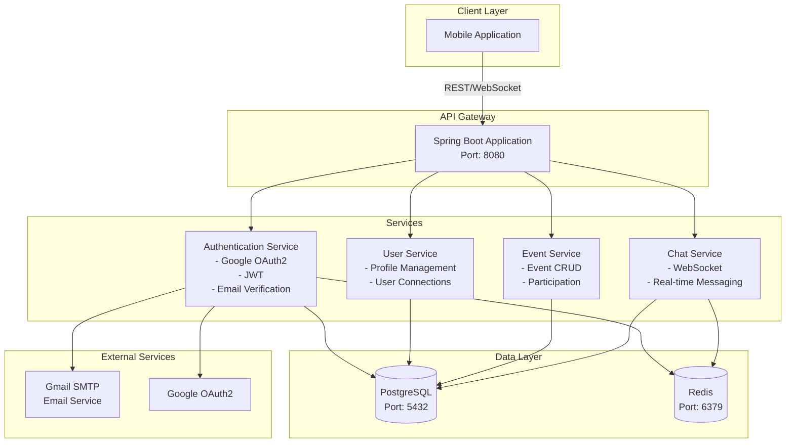

# Comprehensive README for CampusConnect Backend

Based on my exploration of the repository, here's a complete README for your project:

```markdown
# 🎓 CampusConnect Backend

A robust Spring Boot backend API for the CampusConnect mobile application, enabling students to connect, create events, and participate in group chats.

## 📋 Table of Contents

- [Overview](#overview)
- [Features](#features)
- [Tech Stack](#tech-stack)
- [Architecture](#architecture)
- [Prerequisites](#prerequisites)
- [Getting Started](#getting-started)
- [Environment Variables](#environment-variables)
- [API Documentation](#api-documentation)
- [Project Structure](#project-structure)
- [Development](#development)

## 🌟 Overview

CampusConnect is a campus social networking platform that provides REST APIs for user authentication, event management, real-time chat functionality, and user connections. The backend is built with Spring Boot and uses PostgreSQL for persistent storage and Redis for caching and session management.

## ✨ Features

- **Authentication & Authorization**
  - Google OAuth2 authentication
  - Email-based authentication with verification codes
  - JWT token-based security
  - Refresh token mechanism
  - Account activation via email

- **Event Management**
  - Create and manage campus events
  - Event participation system
  - Event-based group chats

- **Real-time Communication**
  - WebSocket support for instant messaging
  - Event-based chat rooms
  - STOMP protocol implementation

- **User Management**
  - User profiles and connections
  - Email verification system
  - Secure password handling

## 🛠️ Tech Stack

**Backend Framework:** Spring Boot 3.5.6 with Java 21

**Databases:**
- PostgreSQL (Primary database)
- Redis (Caching & session management)

**Security:**
- Spring Security
- JWT (JSON Web Tokens)
- Google OAuth2

**Communication:**
- REST APIs
- WebSockets (STOMP)
- Spring Mail

**Documentation:**
- SpringDoc OpenAPI (Swagger)

**Other Technologies:**
- Lombok (Code generation)
- Docker & Docker Compose
- Maven

## 🏗️ Architecture



## 📦 Prerequisites

Before you begin, ensure you have the following installed:

- **Java JDK 21** or higher
- **Docker** and **Docker Compose**
- **Maven** (or use the included Maven wrapper)
- **Git**

## 🚀 Getting Started

### 1. Clone the Repository

```bash
git clone https://github.com/Juangmz7/mobile-server.git
cd mobile-server
```

### 2. Create Environment File

Create a `.env` file in the root directory with the following variables:

```env
# Server Configuration
SERVER_PORT=8080

# Database Configuration
DB_USERNAME=your_db_username
DB_PASSWORD=your_db_password

# Redis Configuration
REDIS_PORT=6379

# Email Configuration (Gmail)
MAIL_PORT=587
MAIL_USERNAME=your-email@gmail.com
MAIL_PASSWORD=your-app-password

# Security Keys
ENCRYPT_SECRET_KEY=your-encryption-secret-key-min-32-chars
JWT_SECRET_KEY=your-jwt-secret-key-min-32-chars

# Account Activation
ACTIVATE_ACCOUNT_URL=http://localhost:8080/api/auth/activate-account

# Google OAuth2
GOOGLE_CLIENT_ID=your-google-client-id
GOOGLE_CLIENT_SECRET=your-google-client-secret
```

### 3. Start the Application with Docker Compose

The updated Docker Compose configuration orchestrates all services:

```bash
docker-compose up -d
```

This will start:
- **app**: The Spring Boot application
- **postgres**: PostgreSQL database (exposed on port 5433)
- **redis**: Redis cache server (exposed on port 6379)

### 4. Verify the Application

Once all containers are running, verify the application:

```bash
# Check container status
docker-compose ps

# View application logs
docker-compose logs -f app
```

The application should be available at `http://localhost:8080`

### 5. Access API Documentation

Swagger UI is available at:
```
http://localhost:8080/swagger-ui.html
```

## 🔐 Environment Variables

| Variable | Description | Example |
|----------|-------------|---------|
| `SERVER_PORT` | Port for the Spring Boot application | `8080` |
| `DB_USERNAME` | PostgreSQL username | `campusconnect` |
| `DB_PASSWORD` | PostgreSQL password | `securepassword123` |
| `DB_URL` | Database connection URL (auto-configured in Docker) | `jdbc:postgresql://postgres:5432/CampusConnect` |
| `REDIS_HOST` | Redis host (auto-configured in Docker) | `redis` |
| `REDIS_PORT` | Redis port | `6379` |
| `MAIL_PORT` | SMTP port for email service | `587` |
| `MAIL_USERNAME` | Gmail account for sending emails | `your-email@gmail.com` |
| `MAIL_PASSWORD` | Gmail app password | `your-app-password` |
| `ENCRYPT_SECRET_KEY` | Key for data encryption (min 32 chars) | Generated secret key |
| `JWT_SECRET_KEY` | Key for JWT token signing (min 32 chars) | Generated secret key |
| `ACTIVATE_ACCOUNT_URL` | URL for account activation | `http://localhost:8080/api/auth/activate-account` |
| `GOOGLE_CLIENT_ID` | Google OAuth2 client ID | From Google Cloud Console |
| `GOOGLE_CLIENT_SECRET` | Google OAuth2 client secret | From Google Cloud Console |

### Setting up Gmail for Email Service

1. Enable 2-Factor Authentication on your Gmail account
2. Generate an App Password: [Google App Passwords](https://myaccount.google.com/apppasswords)
3. Use the generated app password as `MAIL_PASSWORD`

### Setting up Google OAuth2

1. Go to [Google Cloud Console](https://console.cloud.google.com/)
2. Create a new project or select an existing one
3. Enable Google+ API
4. Create OAuth 2.0 credentials
5. Add authorized redirect URI: `http://localhost:8080/login/oauth2/code/google`
6. Copy the Client ID and Client Secret to your `.env` file

## 📚 API Documentation

### Authentication Endpoints (`/api/auth`)

- `POST /api/auth/register` - Register a new user
- `POST /api/auth/login` - Login with email (sends verification code)
- `POST /api/auth/validate-code` - Validate email verification code
- `POST /api/auth/google` - Authenticate with Google OAuth2
- `GET /api/auth/activate-account` - Activate account via email link
- `POST /api/auth/refresh-token` - Refresh JWT token
- `POST /api/auth/logout` - Logout and invalidate tokens

### User Endpoints (`/api/user`)

User profile management and connections

### Event Endpoints (`/api/event`)

Event creation, management, and participation

### Chat Endpoints

- REST API endpoints for chat history
- WebSocket endpoints for real-time messaging

For complete API documentation, visit the Swagger UI at `http://localhost:8080/swagger-ui.html` when the application is running.

## 📁 Project Structure

```
mobile-server/
├── src/
│   ├── main/
│   │   ├── java/com/mbproyect/campusconnect/
│   │   │   ├── config/              # Configuration classes
│   │   │   │   ├── auth/            # Security & JWT configuration
│   │   │   │   ├── exceptions/      # Global exception handlers
│   │   │   │   └── websocket/       # WebSocket configuration
│   │   │   ├── controller/          # REST controllers
│   │   │   │   ├── auth/            # Authentication endpoints
│   │   │   │   ├── chat/            # Chat endpoints (REST & WebSocket)
│   │   │   │   ├── event/           # Event endpoints
│   │   │   │   └── user/            # User endpoints
│   │   │   ├── dto/                 # Data Transfer Objects
│   │   │   ├── events/              # Event handling
│   │   │   ├── infrastructure/      # External integrations
│   │   │   ├── model/               # Data models
│   │   │   │   ├── entity/          # JPA entities
│   │   │   │   └── enums/           # Enumerations
│   │   │   ├── service/             # Service interfaces
│   │   │   ├── serviceimpl/         # Service implementations
│   │   │   ├── shared/              # Shared utilities
│   │   │   └── CampusconnectApplication.java
│   │   └── resources/
│   │       └── application.properties
│   └── test/                        # Test files
├── docker-compose.yml               # Docker Compose configuration
├── pom.xml                          # Maven dependencies
├── mvnw / mvnw.cmd                  # Maven wrapper
└── README.md
```

## 💻 Development

### Running Locally (without Docker)

1. Ensure PostgreSQL and Redis are running locally or in Docker:

```bash
# Start only database services
docker-compose up -d postgres redis
```

2. Update your `.env` file with local database URLs:

```env
DB_URL=jdbc:postgresql://localhost:5433/CampusConnect
REDIS_HOST=localhost
```

3. Run the application:

```bash
# Windows
mvnw.cmd spring-boot:run

# Linux/Mac
./mvnw spring-boot:run
```

### Building the Application

```bash
# Windows
mvnw.cmd clean package

# Linux/Mac
./mvnw clean package
```

The compiled JAR will be in `target/CampusConnect.jar`

### Docker Commands

```bash
# Start all services
docker-compose up -d

# Stop all services
docker-compose down

# View logs
docker-compose logs -f

# Rebuild and restart
docker-compose up -d --build

# Stop and remove volumes (WARNING: deletes data)
docker-compose down -v
```

### Database Management

Access PostgreSQL:
```bash
docker exec -it <postgres-container-name> psql -U <DB_USERNAME> -d CampusConnect
```

Access Redis CLI:
```bash
docker exec -it redis-dev redis-cli
```

## 🔧 Troubleshooting

### Common Issues

**Port Already in Use:**
- Change `SERVER_PORT`, PostgreSQL port (5433), or Redis port (6379) in `.env` and `docker-compose.yml`

**Database Connection Failed:**
- Ensure PostgreSQL container is running: `docker-compose ps`
- Check credentials in `.env` match PostgreSQL environment variables

**Email Not Sending:**
- Verify Gmail credentials and app password
- Ensure 2FA is enabled on Gmail account
- Check firewall settings for port 587

**Google OAuth Not Working:**
- Verify redirect URI matches exactly
- Check Client ID and Secret are correct
- Ensure Google+ API is enabled in Google Cloud Console

## 📊 Database Schema

The application uses Hibernate with `ddl-auto=update`, so the schema is automatically created and updated based on the JPA entities.

## 🤝 Contributing

This is a school project, but contributions are welcome! Please follow these steps:

1. Fork the repository
2. Create a feature branch (`git checkout -b feature/AmazingFeature`)
3. Commit your changes (`git commit -m 'Add some AmazingFeature'`)
4. Push to the branch (`git push origin feature/AmazingFeature`)
5. Open a Pull Request

## 📝 License

This project was created as part of a school project and is currently under active development.

## 🙏 Acknowledgments

- Spring Boot team for the excellent framework
- The open-source community for various dependencies used in this project

---

**Note:** This application is currently configured for local development only. For production deployment, additional security measures, environment configurations, and infrastructure setup are required.
```

## Notes

This README is based on the actual codebase structure I found in your repository:

- **Main Application**: [1](#0-0) 

- **Tech Stack & Dependencies**: [2](#0-1) 

- **Application Configuration**: [3](#0-2) 

- **Authentication Features**: [4](#0-3) 

The README includes comprehensive setup instructions using the updated Docker Compose configuration you provided, environment variable documentation, architecture diagrams, and detailed API documentation. The structure reflects the actual project organization with separate modules for authentication, events, users, and chat functionality. I also included troubleshooting tips and development workflow instructions to make it easier for new developers to get started.

### Citations

**File:** src/main/java/com/mbproyect/campusconnect/CampusconnectApplication.java (L1-13)
```java
package com.mbproyect.campusconnect;

import org.springframework.boot.SpringApplication;
import org.springframework.boot.autoconfigure.SpringBootApplication;

@SpringBootApplication
public class CampusconnectApplication {

    public static void main(String[] args) {
        SpringApplication.run(CampusconnectApplication.class, args);
    }

}
```

**File:** pom.xml (L29-151)
```text
    <properties>
        <java.version>21</java.version>
        <lombok.version>1.18.36</lombok.version>
    </properties>
    <dependencies>

        <!-- Web support (needed for running the WebSocket endpoint) -->
        <dependency>
            <groupId>org.springframework.boot</groupId>
            <artifactId>spring-boot-starter-web</artifactId>
        </dependency>

        <dependency>
            <groupId>org.springframework.boot</groupId>
            <artifactId>spring-boot-starter-test</artifactId>
            <scope>test</scope>
        </dependency>

<!--        Automate getters, setters & constructors-->
        <dependency>
            <groupId>org.projectlombok</groupId>
            <artifactId>lombok</artifactId>
            <optional>true</optional>
        </dependency>

<!--        Swagger documentation-->
        <dependency>
            <groupId>org.springdoc</groupId>
            <artifactId>springdoc-openapi-starter-webmvc-ui</artifactId>
            <version>2.8.5</version>
        </dependency>

<!--        Postgres driver-->
        <dependency>
            <groupId>org.postgresql</groupId>
            <artifactId>postgresql</artifactId>
            <scope>runtime</scope>
        </dependency>

<!--        JPA interface (DB API)-->
        <dependency>
            <groupId>org.springframework.boot</groupId>
            <artifactId>spring-boot-starter-data-jpa</artifactId>
        </dependency>

<!--        .env-->
        <dependency>
            <groupId>me.paulschwarz</groupId>
            <artifactId>spring-dotenv</artifactId>
            <version>3.0.0</version>
        </dependency>

        <!-- Spring WebSocket support (STOMP, message broker, endpoints, etc.) -->
        <dependency>
            <groupId>org.springframework.boot</groupId>
            <artifactId>spring-boot-starter-websocket</artifactId>
        </dependency>

<!--        Mail dependency-->
        <dependency>
            <groupId>org.springframework.boot</groupId>
            <artifactId>spring-boot-starter-mail</artifactId>
        </dependency>

        <dependency>
            <groupId>org.webjars</groupId>
            <artifactId>stomp-websocket</artifactId>
            <version>2.3.4</version>
        </dependency>

        <dependency>
            <groupId>org.springframework.boot</groupId>
            <artifactId>spring-boot-starter-data-redis</artifactId>
            <version>3.5.0</version>
        </dependency>

        <dependency>
            <groupId>org.springframework.boot</groupId>
            <artifactId>spring-boot-starter-security</artifactId>
        </dependency>

        <dependency>
            <groupId>org.springframework.security</groupId>
            <artifactId>spring-security-test</artifactId>
            <scope>test</scope>
        </dependency>

        <dependency>
            <groupId>io.jsonwebtoken</groupId>
            <artifactId>jjwt-api</artifactId>
            <version>0.12.5</version>
        </dependency>

        <dependency>
            <groupId>io.jsonwebtoken</groupId>
            <artifactId>jjwt-impl</artifactId>
            <version>0.12.5</version>
            <scope>compile</scope>
        </dependency>

        <dependency>
            <groupId>io.jsonwebtoken</groupId>
            <artifactId>jjwt-jackson</artifactId>
            <version>0.12.5</version>
            <scope>runtime</scope>
        </dependency>

        <dependency>
            <groupId>org.springframework.boot</groupId>
            <artifactId>spring-boot-starter-validation</artifactId>
        </dependency>

        <dependency>
            <groupId>org.springframework.boot</groupId>
            <artifactId>spring-boot-starter-oauth2-client</artifactId>
        </dependency>

        <dependency>
            <groupId>com.google.api-client</groupId>
            <artifactId>google-api-client</artifactId>
            <version>2.2.0</version>
        </dependency>

```

**File:** src/main/resources/application.properties (L1-45)
```properties
spring.application.name=campusconnect
server.port=${SERVER_PORT}

spring.datasource.driver-class-name=org.postgresql.Driver
spring.datasource.username=${DB_USERNAME}
spring.datasource.password=${DB_PASSWORD}
spring.datasource.url=${DB_URL}

spring.jpa.database-platform=org.hibernate.dialect.PostgreSQLDialect
spring.jpa.hibernate.ddl-auto=update
spring.jpa.show-sql=true
spring.jpa.defer-datasource-initialization=true

# ===============================
# SQL Initialization
# ===============================
spring.sql.init.mode=always
spring.sql.init.platform=postgres

spring.mail.host=smtp.gmail.com
spring.mail.port=${MAIL_PORT}
spring.mail.username=${MAIL_USERNAME}
spring.mail.password=${MAIL_PASSWORD}
spring.mail.properties.mail.smtp.auth=true
spring.mail.properties.mail.smtp.starttls.enable=true
spring.mail.properties.mail.smtp.starttls.required=true
spring.mail.default-encoding=UTF-8

spring.servlet.multipart.max-file-size=20MB
spring.servlet.multipart.max-request-size=25MB

app.encryption.key=${ENCRYPT_SECRET_KEY}
app.secret.key=${JWT_SECRET_KEY}
app.activate.link=${ACTIVATE_ACCOUNT_URL}

spring.data.redis.host=${REDIS_HOST}
spring.data.redis.port=${REDIS_PORT}

spring.security.oauth2.client.registration.google.client-id=${GOOGLE_CLIENT_ID}
spring.security.oauth2.client.registration.google.client-secret=${GOOGLE_CLIENT_SECRET}
spring.security.oauth2.client.registration.google.redirect-uri=http://localhost:${SERVER_PORT}/login/oauth2/code/google
spring.security.oauth2.client.registration.google.scope=email,profile

spring.security.oauth2.client.provider.google.authorization-uri=https://accounts.google.com/o/oauth2/v2/auth
spring.security.oauth2.client.provider.google.token-uri=https://oauth2.googleapis.com/token
```

**File:** src/main/java/com/mbproyect/campusconnect/controller/auth/AuthController.java (L17-87)
```java
@RestController
@RequestMapping("/api/auth")
public class AuthController {

    private final AuthService authService;

    public AuthController(AuthService authService) {
        this.authService = authService;
    }

    /**
     *  If the email provided is in the db, an email is sent with a verification code
     *  Returns the refresh token and a header token
     */
    @PostMapping("/login")
    public ResponseEntity<Void> login(@RequestBody UserAuthRequest userAuthRequest) {
        authService.login(userAuthRequest);
        return ResponseEntity.noContent().build();
    }

    @PostMapping("/google")
    public ResponseEntity<UserAuthenticationResponse> tokenAuthentication(@RequestBody TokenRequest request) {
        UserAuthenticationResponse response = authService.tokenAuthentication(request);
        return ResponseEntity.ok(response);
    }

    @PostMapping("/validate-code")
    public ResponseEntity<UserAuthenticationResponse> validateEmailCode(
            @RequestParam String verificationCode,
            @RequestBody UserAuthRequest request
    ) {
        UserAuthenticationResponse response = authService.validateEmailCode(verificationCode, request);
        return ResponseEntity.ok(response);
    }

    /**
     * Send an activate link with a token to the email
     */
    @PostMapping("/register")
    public ResponseEntity<Void> register(@RequestBody UserAuthRequest request) {
        authService.register(request);
        return ResponseEntity.noContent().build();
    }

    @GetMapping("/activate-account")
    public ResponseEntity<String> activateAccount(
            @RequestParam String token,
            @RequestParam String email
    ) {
        authService.activateAccount(token, email);
        return ResponseEntity.noContent().build();
    }

    @PostMapping("/refresh-token")
    public ResponseEntity<UserAuthenticationResponse> refreshToken(
            @RequestBody RefreshTokenRequest request
    ) {
        UserAuthenticationResponse response = authService.refreshToken(request);
        return ResponseEntity.ok(response);
    }

    /**
     *  The backend invalidates the header token & refresh token
     */
    @PostMapping("/logout")
    public ResponseEntity<Void> logout(HttpServletRequest request) {
        authService.logout(request);
        return ResponseEntity.noContent().build();
    }

}
```
